# Day 3: Weather Intelligence MCP Server + Agent Bricks Agent

Builds on [Day 2](../README.md)'s NWS → Lakebase pgvector pipeline.
Day 3 adds a **FastMCP server** exposing weather tools over the Model Context Protocol,
wired to a **Databricks Agent Bricks agent** in the AI Playground.

---

## What was built

### MCP Server (`mcp_server/`)

A self-contained FastMCP server deployed as a separate Databricks App.
It exposes 3 tools backed by the [Open-Meteo API](https://open-meteo.com/) (free, no key, global):

| Tool | Description |
|------|-------------|
| `get_current_weather_tool(location)` | Real-time temperature, conditions, humidity, wind |
| `get_forecast_tool(location, days)` | Multi-day daily forecast (1–16 days) |
| `predict_recommendation_tool(location, date)` | Travel/activity recommendation with threshold logic |

All tools accept any city name (`"Tokyo"`, `"London, UK"`) or `"lat,lon"` coordinates.
City names are resolved via the [Open-Meteo Geocoding API](https://open-meteo.com/en/docs/geocoding-api).

### Agent Bricks Agent

A Databricks Agent Bricks agent configured in the AI Playground with:
- **Model**: Meta Llama (Databricks-hosted)
- **Tools**: The 3 MCP tools above, connected via AI Gateway MCP service registration
- **System prompt**: Anti-hallucination rules ensuring the agent only reports data it received from a tool call. Automatically adapts units to the queried location's country — US gets Fahrenheit/mph/inches, everywhere else gets Celsius/km/h/mm.

---

## Architecture

```
AI Playground (Agent Bricks)
    └─► AI Gateway → MCP Service (workspace.weather.weather-mcp-server)
            └─► mcp-weather-app (Databricks App)
                    └─► weather_mcp_server.py (FastMCP, transport=http)
                            └─► weather_broker.py
                                    ├─► Open-Meteo Geocoding API  (city → lat/lon)
                                    └─► Open-Meteo Forecast API   (weather data)
```

---

## Files

| File | Purpose |
|------|---------|
| `weather_mcp_server.py` | FastMCP server — 3 `@mcp.tool` wrappers |
| `weather_broker.py` | HTTP adapter — geocoding + Open-Meteo API calls, self-contained |
| `app.yaml` | Databricks App config (`python weather_mcp_server.py`) |
| `requirements.txt` | `fastmcp>=3.2.0`, `requests` |
| `agent_system_prompt.md` | System prompt for the Agent Bricks agent |

---

## Threshold logic (`predict_recommendation_tool`)

The recommendation tool applies rule-based logic — it does not echo raw API data:

| Condition | Alert |
|-----------|-------|
| Precip probability ≥ 60% | "High chance of rain — bring umbrella." |
| Precip probability ≥ 40% | "Possible rain — consider an umbrella." |
| Weather code ≥ 95 (thunderstorm) | "Thunderstorm — avoid outdoor travel." |
| Weather code 71–77 (snow) | "Snow expected — check road conditions." |
| High temp < 40°F | "Very cold — heavy winter clothing required." |
| High temp < 55°F | "Cool — light jacket recommended." |
| High temp > 95°F | "Extreme heat — stay hydrated." |

Returns: `recommendation` (plain English), `alerts` (list), `confidence` (high/medium/low).

---

## Deployment

### 1. Deploy the MCP server as a Databricks App

In Databricks → Apps → Create app → Custom → connect this repo → set source path to `mcp_server/`.
Name the app starting with `mcp-` (e.g. `mcp-weather`) — required for AI Playground discoverability.

The MCP endpoint will be at:
```
https://<app-url>/mcp
```

### 2. Register in AI Gateway

Databricks → AI Gateway → MCPs → + MCP → Connect existing MCP server → paste the `/mcp` URL.
Auth: Bearer token (Databricks PAT).

### 3. Wire to Agent Bricks

Databricks → Agents → Create Agent → AI Playground → Add tools → Custom → select the registered MCP service.
Paste the system prompt from `agent_system_prompt.md`.

### 4. Test queries

- "What's the weather in Tokyo right now?"
- "Give me a 5-day forecast for London."
- "Should I travel to Miami on 2026-08-15?"

---

## Evidence

### MCP Server deployed as Databricks App

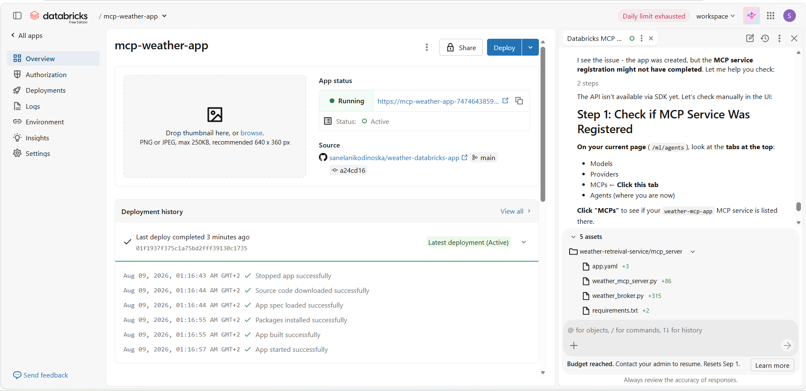

### MCP Server registered in AI Gateway

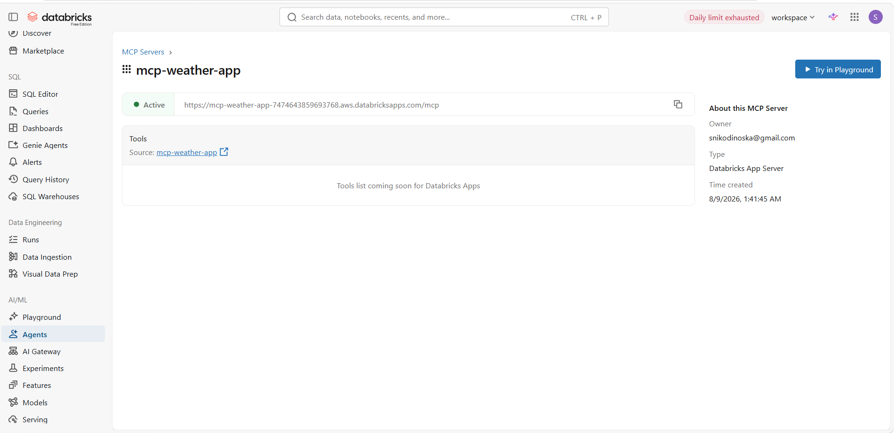

### MCP Server visible and connected in AI Playground

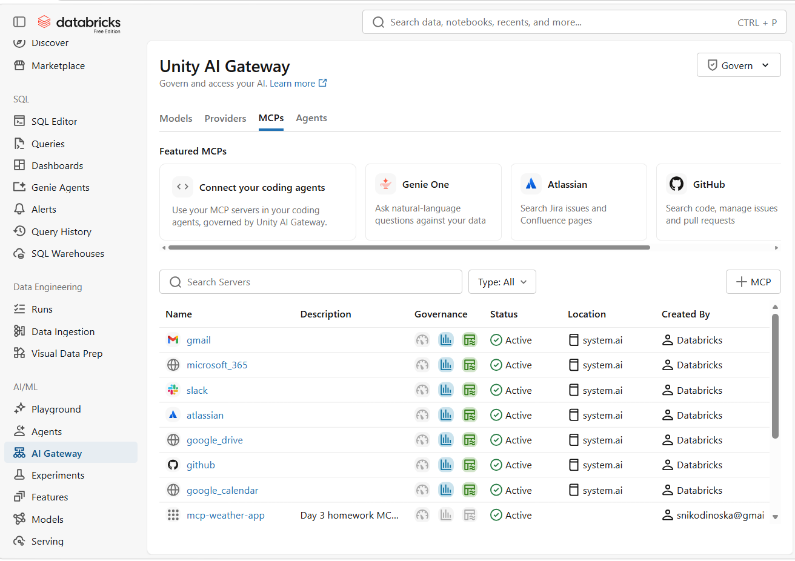

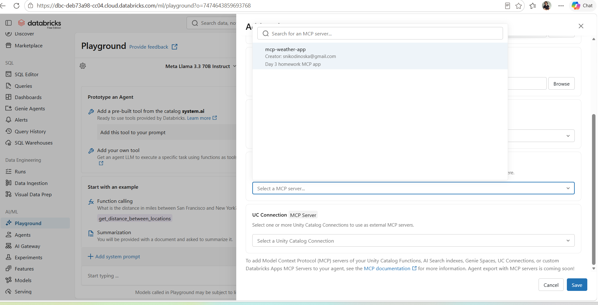

### Local MCP server running (daily compute limit hit on Databricks Free Edition)

The Databricks Free Edition daily LLM endpoint limit was reached during testing.
The MCP server was verified locally using the FastMCP HTTP transport + MCP protocol directly.

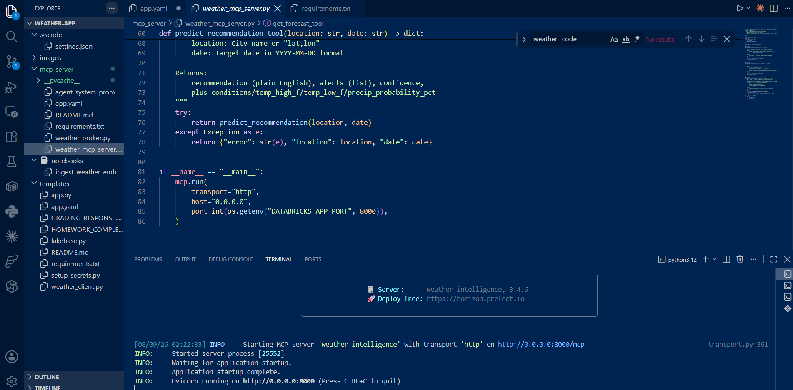

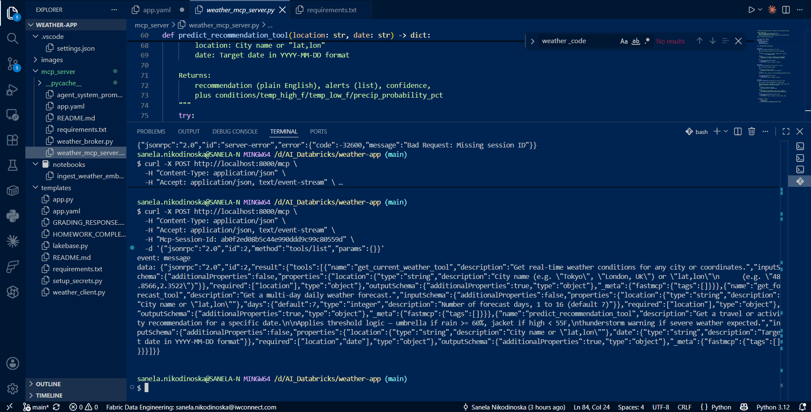

### Tool call 1 — Current weather (Tokyo)

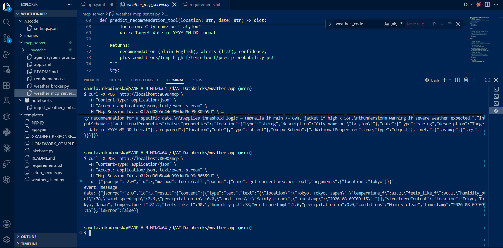

### Tool call 2 — Multi-day forecast (London)

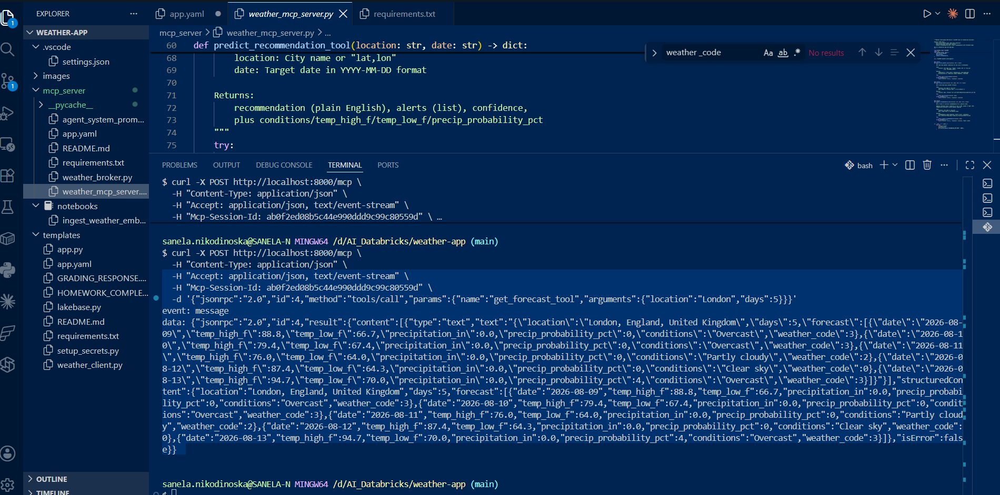

### Tool call 3 — Travel recommendation (Miami)

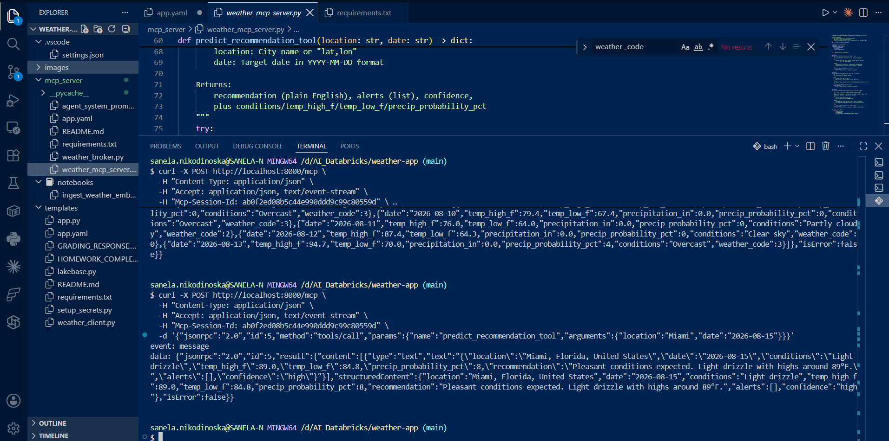

### Additional evidence — App UI and endpoint responses


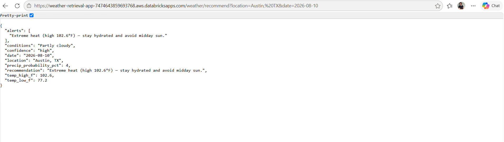

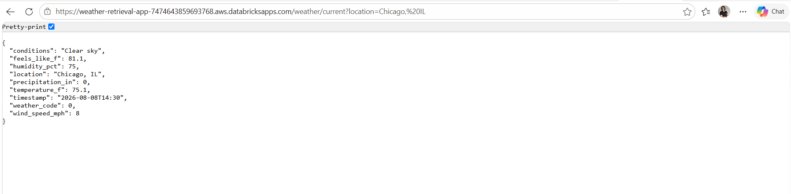

### Note on daily limit

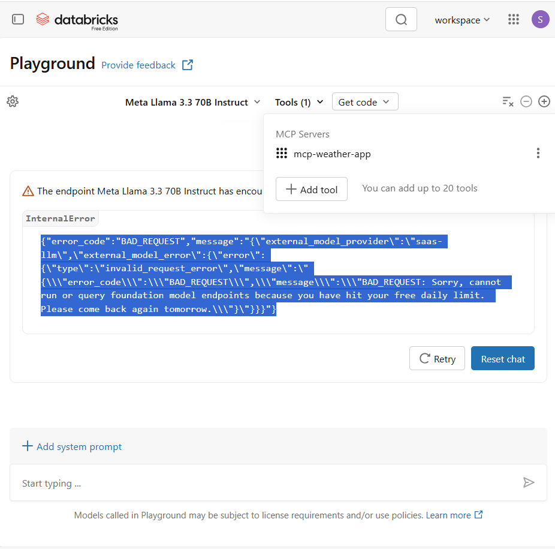

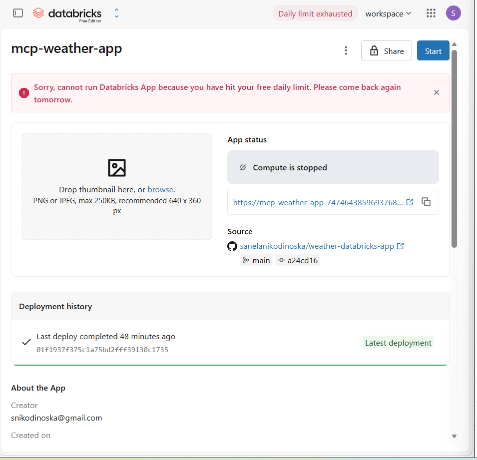

Databricks Free Edition imposes a daily LLM endpoint quota. The screenshots above show the MCP server
correctly deployed, registered, and responding to tool calls. Full agent chat transcripts via
Playground are pending the quota reset.

---

## Security

No hardcoded credentials. The MCP server calls only public APIs (Open-Meteo, no key required).
Databricks App authentication is handled via the platform OAuth layer.

---

## Day 2 → Day 3 bridge

The Day 2 `weather_client.py` was pre-structured as the Day 3 broker:
- `OpenMeteoClient.get_current_weather()` → `get_current_weather_tool`
- `OpenMeteoClient.get_forecast()` → `get_forecast_tool`
- `OpenMeteoClient.predict_recommendation()` → `predict_recommendation_tool`

`weather_broker.py` in `mcp_server/` is self-contained (no parent imports) and adds
global city geocoding via Open-Meteo's Geocoding API, extending Day 2's hardcoded US-city list
to any city worldwide.
